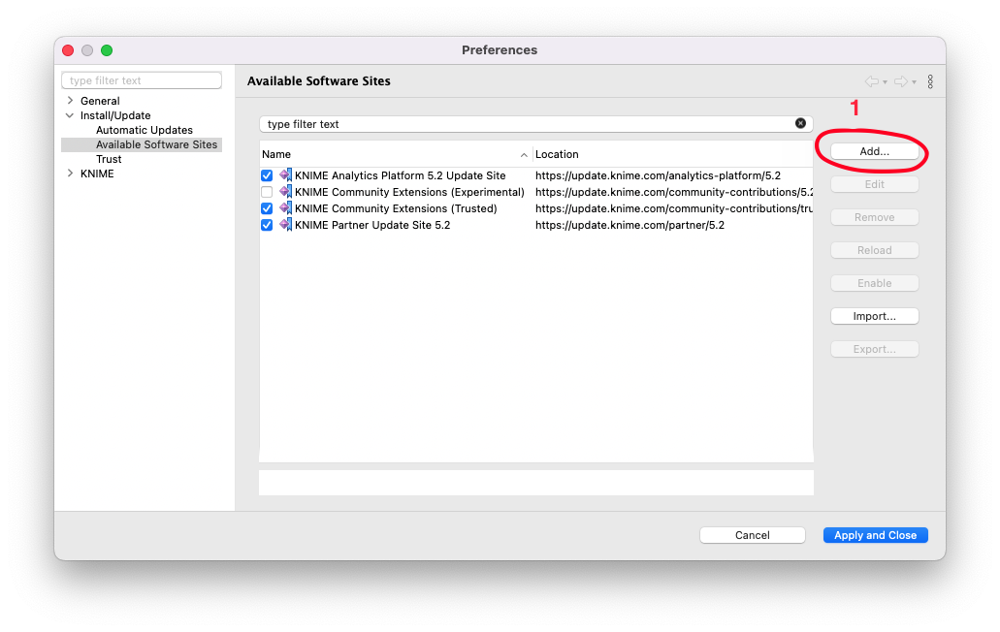

# Prerequisites:

The PST Extension is build on top of `libpff-python`, a Python library for accessing the Personal Folder File (PFF) and the Offline Folder File (OFF) formats.

### 1- Install C++ Built Tools for Windows:

Building `libpff-python` libarary requires having C++ Built Tools installed on your Operating System.

Download Microsoft C++ Build Tools and follow the instructions in the video below to complete the installation:

### 2- Install Conda package management system:

PST Extension is a Knime Python based Extension, we bundle the source files together with the required packages using conda as the bundling channel. 
[Anaconda](https://docs.anaconda.com/free/miniconda/) requires a commercial license for certain business uses, particularly in large enterprises. If you are in a Corporate Environment, we addvice you to use Minforge because of the following reasons:

- Cost: No licensing fees or enterprise costs are associated with using Miniforge, which can be significant for large companies.
- Customizability: You can build environments with only the packages you need, minimizing resource usage.
- Flexibility: Since it uses Conda, you can easily manage environments and package dependencies, providing flexibility in your development and deployment workflows.

To setup Miniforge:

- Go to the [Miniforge](https://conda-forge.org/miniforge/) website

- Download the appropriate installer for your OS

# Installation

The extesnion can be installed via the [Knime Hub](https://hub.knime.com/redfield/extensions/ai.redfield.features.pst/latest) by dragging and dropping the node icon or installed via the Knime Extension Manager.

# Update site installation (Only for development purposes)

You can currently install the extension through the [zipped update site](https://drive.google.com/drive/folders/1xDHDRN0CnylSSf24QgzIbFbWg3NZnl0K?usp=sharing). Once you've downloaded and unzipped the folder, follow these steps to access the extension:

- Add the unzipped folder to KNIME AP as a Software Site in File → Preferences → Install/Update → Available Software Sites

- Go to Install KNIME Extensions and search for `personal storage table `

- After completing the installation, restart KNIME.

You will find the PST Extension under the Community Nodes.

