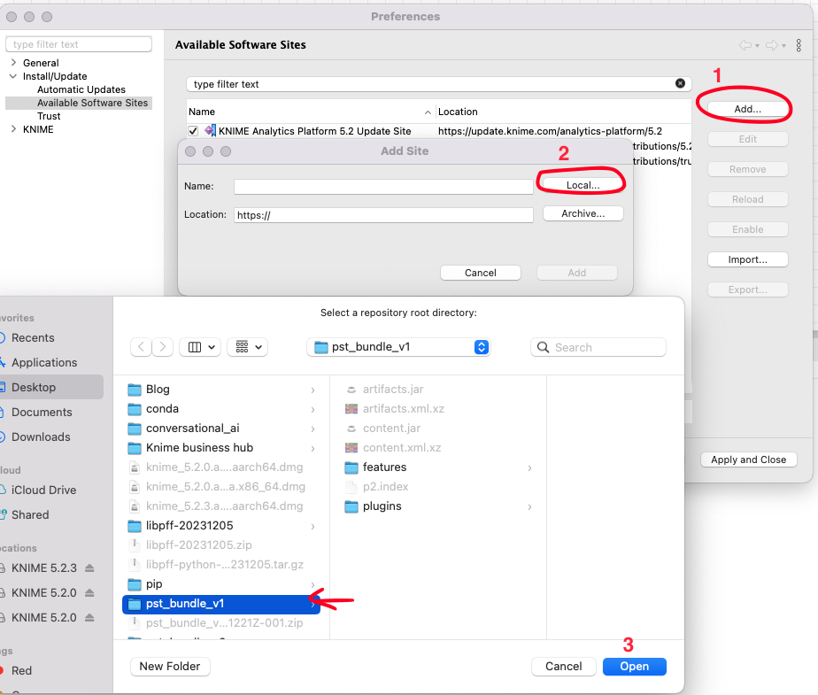
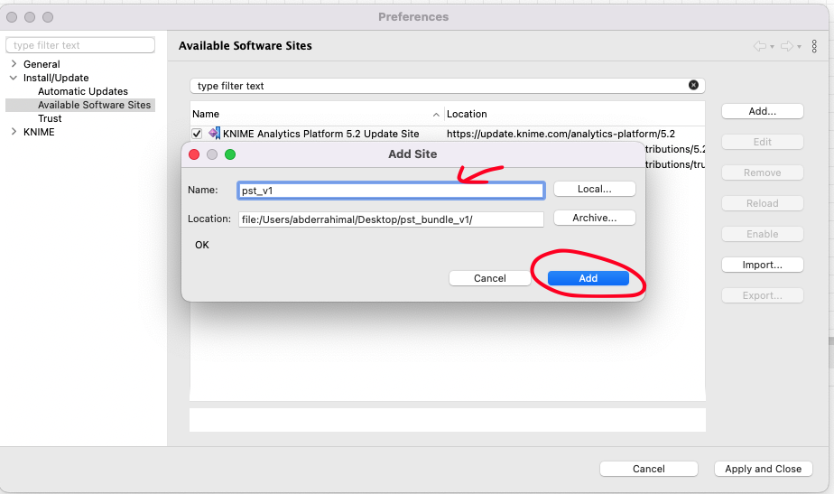
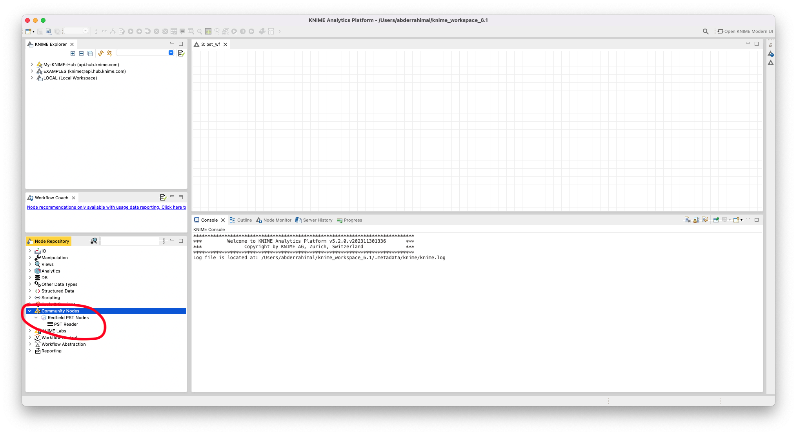

# Prerequisites:

The PST Extension is build on top of `libpff-python`, a Python library for accessing the Personal Folder File (PFF) and the Offline Folder File (OFF) formats.

### 1- Install C++ Built Tools for Windows:

Building `libpff-python` libarary requires having C++ Built Tools installed on you Operating System.

Download Microsoft C++ Build Tools and follow the instructions in the video below to complete the installation:

### 2- Install Anaconda:

PST Extension is a Knime Python based Extension, we bundle the source files together with the required packages using conda as the bundling channel. Here is the quickest way to setup conda:

- Go to the [Miniconda](https://docs.anaconda.com/free/miniconda/) website

- Download the appropriate installer for your OS

- For Windows and macOS: run the installer executable

- For Linux: execute the script in terminal (see [here](https://conda.io/projects/conda/en/latest/user-guide/install/linux.html) for help)

# Update site installtion (Dev)

You can currently install the extension through the [zipped update site](https://drive.google.com/drive/folders/1xDHDRN0CnylSSf24QgzIbFbWg3NZnl0K?usp=sharing). Once you've downloaded and unzipped the folder, follow these steps to access the extension:

- Add the unzipped folder to KNIME AP as a Software Site in File → Preferences → Install/Update → Available Software Sites

- Go to Install KNIME Extensions and search for `personal storage table `

- After completing the installation, restart KNIME.

You will find the PST Extension under the Community Nodes.

